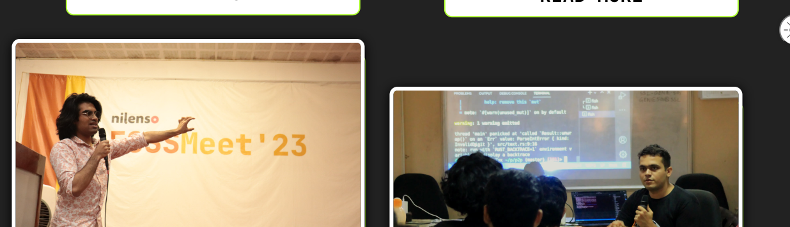

# As a great man once said, "Its important to design before you implement a project. "
## Brief of the tasks
Your task is to create a user-friendly landing page for FOSSMEET 2024. 

The focus is on providing essential information about the event in a straightforward manner while incorporating some key features. 

Include visuals and snippets that showcase :

1. prominent open source organizations. Emphasize the importance of FOSS in
technology and collaboration. 

2. Design a section that lists the events scheduled for
FOSSMEET 2024. Ensure a clear layout for easy navigation through event details.

3. Implement a gallery section featuring pictures from FOSSMEET 2023. 

4. Develop an FAQ section that addresses common attendee queries. 

Feel free to draw inspiration from the design of https://www.fossmeet.net, but it's essential to infuse your unique
interpretation into the design. ( Eg. Cybersecurity aspect of FOSS can be
highlighted. )  

---  
  
1. - IDK what the first line means 
   -  
2.  
    - Events page, 
    - Events overview in home screen after hero  
    - Make a timeline for the events

3. - Implement a slider on home page to show past images
   - "Past editions" page with:
     - some lines on the events history
     - A gallery page


## Color scheme:
```css
color:#0c0c0c; //grey
color:#f7a144; //yellow
color:#ef7900; //ochre
color:#d45101; //orange
```
#000000 #0c0c0c #f7a144 #ef7900 #d45101


# Content:

# 1. All different pages:

## 1.A Home page
- ### Navbar
- ### Hero Section
  - **Event Tagline:** "Unleashing the Power of Open Source Collaboration."
  - **Call-to-Action Button:** "Register Now" button linking to the registration page.
  - **Visual:** Dynamic image collage showcasing diverse open source activities.

# Tasks:

## - [x] Small boxes to show events:

## -[ ] Expands on click - event box
 

## - [ ] Marquee overflwo issue :  debug and fix


## - [ ] Fix the box css to flex to the top lines


## - [ ] Second navbar width malfunction  


## - [ ]  Customize footer  


## - [ ] Figure out light dark mode properly and not just for the body  
  

## - [ ] Make sure the dark mode button works on each screen


